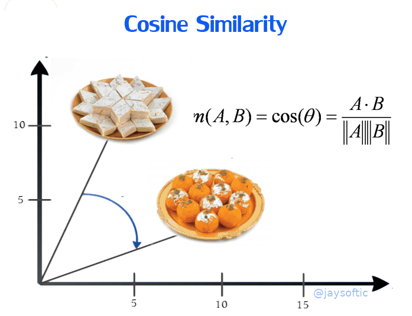

# Indian Famous Cuisine Recommendation :india: 

## Table of Content
  * [Introduction](#introduction)
  * [Demo](#demo)
  * [Overview](#overview)
  * [Technologies Used](#technologies-used)
  * [Team](#team)
  * [Credits](#credits)

## Introduction
This project is about **Indian Cuisine** here i have 255 famous indian dishes. When user will click on any dish they will get a recipe and recommendation for that particular dish.
Here i have used youtube videos for cuisine recipe and i have build a machine learning model using cosine similarity for recommendation

## Demo
- I have deployed this on AWS Elastic Beanstalk platform

Link: [http://indiancuisine.us-east-2.elasticbeanstalk.com/](http://indiancuisine.us-east-2.elasticbeanstalk.com/)

 

## Overview
- In this project i have used indian food data set from kaggle you can get it from [here](https://www.kaggle.com/nehaprabhavalkar/indian-food-101)
- I have analyzed the data set and make it in shape that it help me to build a recommendation model
- Here i have used Cosine Similarity to build a recommendation model.
- Cosine similarity is nothing but a degree between two data points or two similar type of data
  

- I made web app using flask, javascript, bootstrap, css and HTML you can find all the files inside this Repository

- Here i have used [bing_image_downloader](https://pypi.org/project/bing-image-downloader/) to scrape and download all dishes images

- Here i have used [youtubesearchpython](https://pypi.org/project/youtube-search-python/) to get unique id of recipe vidoes from youtube which i have demonstrated at front end side as embedded video of recipe.

## Technologies Used

## Team
 |
-|
[Jay Soni](https://in.linkedin.com/in/jaysoftic) |)

## Credits
- Entire credits goes to My God
- Cuisine Images credits goes to bing search engine
- Cuisine Recipe credits goes to youtube

## 
- If you like my work and it helped you in anyway then please do ⭐ the repository it will motivate me to make more amazing projects
